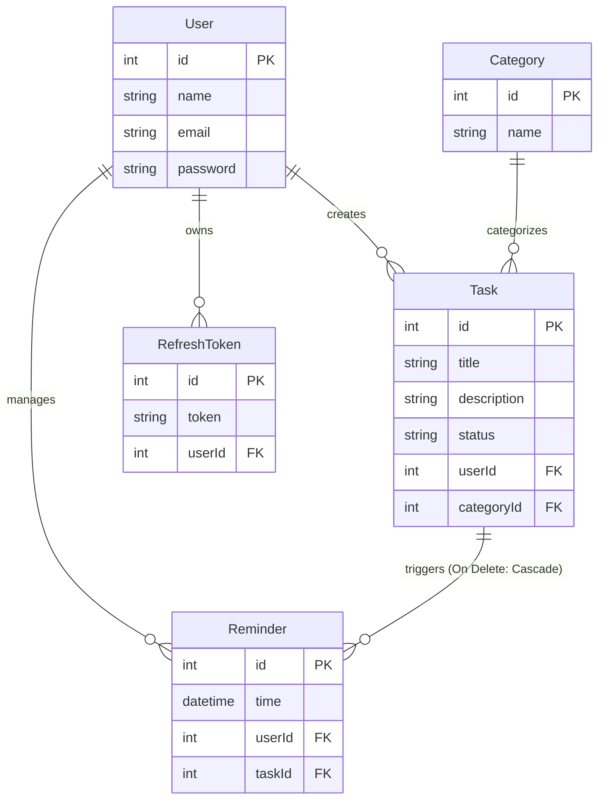
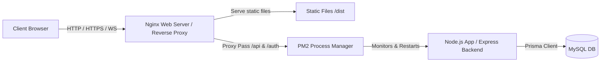

# WAD Frontend Client

> Proyek Single-Page Application (SPA) berbasis **React**, **Vite**, **React Router**, **Axios**, dan **Socket.IO** untuk manajemen tugas secara kolaboratif dan real-time.

---

## ✨ Deskripsi Singkat & Arsitektur

Frontend ini dirancang untuk mendukung fitur manajemen tugas secara efisien dan responsif sebagai bagian dari sistem **WAD Task Manager**. Arsitektur aplikasi difokuskan pada aspek modularitas dengan memisahkan beberapa lapisan (layer) utama:

*   **State Autentikasi Global**: Manajemen sesi pengguna secara menyeluruh menggunakan React Context API.
*   **Koneksi WebSocket Real-time**: Integrasi Socket.IO Client untuk sinkronisasi pembaruan data secara instan tanpa perlu memuat ulang halaman.
*   **Notifikasi Toast Reaktif**: Umpan balik visual langsung bagi pengguna untuk setiap interaksi atau perubahan data.
*   **Service Layer**: Abstraksi komunikasi API menggunakan Axios yang dilengkapi dengan *interceptor* otomatis untuk *token injection* dan penanganan *refresh token* saat kedaluwarsa.

---

## 🛠️ Teknologi Utama

| Kategori | Teknologi | Fungsi |
| :--- | :--- | :--- |
| **Build Tool** | Vite | Bundling dan development server yang sangat cepat |
| **UI Library** | React 19 | Komponen antarmuka deklaratif berbasis Hooks |
| **Routing** | React Router v7 | Navigasi halaman (SPA) dan proteksi rute (*Route Guard*) |
| **Form Management** | React Hook Form | Validasi input dan pengelolaan *state* form |
| **HTTP Client** | Axios | Komunikasi REST API dengan mekanisme *interceptor* JWT |
| **Real-Time** | Socket.IO Client 4.x | Sinkronisasi *event* secara real-time via WebSocket |
| **State Management** | Context API | Manajemen sesi *auth* dan notifikasi *toast* secara global |

---

## 🚀 Panduan Setup & Instalasi Lokal

### 1. Persyaratan Sistem
*   **Node.js** v20 atau versi yang lebih baru
*   **npm** v10 atau versi yang lebih baru
*   **Backend Server** yang sudah berjalan di `http://localhost:3000`

### 2. Instalasi & Menjalankan Frontend
Jalankan perintah berikut pada terminal Anda:

```bash
# Masuk ke direktori frontend
cd wad-frontend

# Install seluruh dependensi proyek
npm install

# Jalankan development server
npm run dev
```

Setelah development server berhasil berjalan, buka browser Anda dan akses:
👉 **[http://localhost:5173](http://localhost:5173)**

> [!NOTE]
> Proyek ini menggunakan konfigurasi proxy internal Vite untuk meneruskan request rute `/api` dan `/auth` secara langsung ke backend server.

---

### 3. Persiapan Cepat Backend (Quick Setup)
Jika Anda belum menjalankan backend, buka terminal terpisah dan jalankan langkah-langkah berikut pada folder repositori backend Anda (`wad-capstone`):

```bash
# Masuk ke direktori backend (sesuaikan nama foldernya jika berbeda)
cd wad-capstone

# Install dependensi backend
npm install

# Jalankan migrasi database
npx prisma migrate dev --name init

# Jalankan seeder database untuk data awal
npm run db:seed

# Jalankan development server untuk backend
npm run dev
```

---

### 4. Akun Uji Coba (Test Accounts)
Anda dapat menggunakan kredensial bawaan berikut yang bersumber dari seeder database untuk melakukan pengujian:

| Peran (Role) | Email | Password |
| :--- | :--- | :--- |
| **Pengguna Biasa (User)** | `budi@example.com` | `password123` |
| **Administrator (Admin)** | `admin@example.com` | `password123` |

---

## 📖 Integrasi API & Event WebSocket

### 🌐 Konsumsi REST API (via Axios)

| Method | Endpoint | Fungsi di Frontend |
| :--- | :--- | :--- |
| **POST** | `/auth/register` | Mendaftarkan akun baru |
| **POST** | `/auth/login` | Otentikasi user & menyimpan token ke Token Store |
| **POST** | `/auth/refresh` | Dipanggil otomatis oleh Axios Interceptor saat token akses kedaluwarsa |
| **POST** | `/auth/logout` | Menghapus sesi lokal dan mengirim sinyal logout ke server |
| **GET** | `/api/v1/users` | Mengambil data profil user yang sedang aktif |
| **GET** | `/api/v1/tasks` | Mengambil daftar task (mendukung filter & pagination) |
| **POST** | `/api/v1/tasks` | Membuat task baru |
| **PUT** | `/api/v1/tasks/:id` | Memperbarui status atau data spesifik dari task |
| **DELETE** | `/api/v1/tasks/:id`| Menghapus task berdasarkan ID |
| **GET** | `/api/v1/reminders/upcoming` | Mengambil daftar pengingat tugas yang akan datang |

### 🔌 Listener Event Socket.IO

| Event Name | Aksi di Frontend | Deskripsi |
| :--- | :--- | :--- |
| `taskCreated` | Update UI & State | Menampilkan toast notifikasi dan menambahkan task baru secara instan tanpa reload. |
| `taskUpdated` | Update UI & State | Memperbarui visual kartu task yang diedit/diubah statusnya secara real-time. |
| `reminderAlert`| Show Notification | Menampilkan dialog/peringatan visual saat waktu pengingat telah tiba. |

---

## 📊 Struktur Relasi Database (ERD)

Meskipun repositori ini merupakan sisi frontend client, berikut adalah skema database relasional pada backend yang menyuplai data ke aplikasi ini:



### Penjelasan Relasi:
1.  **User ➔ Task**: Satu pengguna dapat memiliki banyak tugas sekaligus (*One-to-Many*).
2.  **User ➔ Reminder**: Satu pengguna dapat memiliki banyak pengingat untuk tugas-tugas yang berbeda.
3.  **Task ➔ Reminder**: Setiap pengingat harus terhubung ke satu tugas spesifik. Jika tugas tersebut dihapus, semua data pengingat terkait akan ikut terhapus secara otomatis (*Cascade*).
4.  **Category ➔ Task**: Sebuah kategori dapat digunakan oleh banyak tugas untuk pengelompokan yang lebih teratur.
5.  **User ➔ RefreshToken**: Digunakan untuk menyimpan refresh token sebagai bagian dari manajemen sesi autentikasi JWT secara aman.

---

## 🏗️ Arsitektur Deployment & Akses URL

Aplikasi ini dirancang untuk di-deploy menggunakan arsitektur full-stack serta dapat diakses melalui domain publik maupun port IP eksternal berikut:

### Tautan Akses Produksi
Aplikasi web yang berjalan di lingkungan server dapat diakses langsung oleh publik via peramban melalui tautan berikut:
*  Akses Domain (HTTPS): https://task-manager.marshelinda.my.id
*  Akses IP Server (HTTP): http://103.93.135.78:3001



*   **Nginx**: 
    *   Bertindak sebagai web server utama untuk menyajikan (*serve*) berkas statis hasil build React/Vite (dari folder `/dist`) langsung ke browser pengguna.
    *   Bertindak sebagai *Reverse Proxy* untuk meneruskan request API (`/api`, `/auth`) dan koneksi WebSocket dari klien secara aman ke port internal Node.js.
    *   Mengamankan lalu lintas data dengan mengelola sertifikat SSL (HTTPS).
*   **PM2 (Process Manager)**: Menjalankan backend Express.js di latar belakang sebagai daemon, menjaga ketersediaan aplikasi (*auto-restart* jika terjadi *crash*), serta melakukan manajemen log.
*   **Node.js App (Backend)**: Memproses logika bisnis, merespons REST API, mengatur JWT, berinteraksi dengan database, serta memancarkan event Socket.IO ke frontend.
*   **MySQL DB**: Menyimpan seluruh data relasional aplikasi secara aman yang diakses backend menggunakan Prisma ORM.

---

## 📁 Struktur Folder Proyek

```text
wad-frontend/
├─ public/                              # Aset statis publik (gambar, favicon)
├─ src/
│  ├─ components/                       # Komponen UI modular
│  │  ├─ Navbar.jsx                     # Navbar atas dengan indikator status online
│  │  ├─ ProtectedRoute.jsx             # Route Guard untuk membatasi akses halaman non-login
│  │  ├─ TaskCard.jsx                   # Komponen kartu presentasi data tugas
│  │  ├─ TaskForm.jsx                   # Form reaktif untuk membuat & mengedit tugas
│  │  └─ ToastContainer.jsx             # Container untuk me-render antrean notifikasi toast
│  ├─ contexts/                         # Pengelola state global (Context API)
│  │  ├─ AuthContext.jsx                # Manajemen autentikasi, login, logout & token
│  │  ├─ NotifContext.jsx               # Penyedia fungsi notifikasi toast global
│  │  └─ SocketContext.jsx              # Inisialisasi koneksi Socket.IO & deteksi koneksi
│  ├─ hooks/                            # Custom React Hooks
│  │  └─ useRealTimeTasks.js            # Custom hook listener event Socket.IO untuk pembaruan task
│  ├─ lib/                              # Konfigurasi library pihak ketiga
│  │  ├─ axios.js                       # Kustomisasi Axios instance & interceptors JWT
│  │  └─ tokenStore.js                  # Helper penyimpanan token (Local/Session Storage)
│  ├─ pages/                            # Komponen halaman utama (Pages)
│  │  ├─ LoginPage.jsx                  # Halaman masuk sistem
│  │  ├─ ProfilePage.jsx                # Halaman informasi detail profil user
│  │  ├─ RegisterPage.jsx               # Halaman pendaftaran akun baru
│  │  └─ TasksPage.jsx                  # Dashboard daftar dan pengelolaan tugas
│  ├─ services/                         # Service Layer untuk komunikasi HTTP
│  │  └─ task.service.js                # Kumpulan fungsi pemanggil API terkait tugas
│  ├─ index.css                         # File styling CSS global
│  └─ main.jsx                          # Titik masuk utama aplikasi (Entry Point)
```
```
